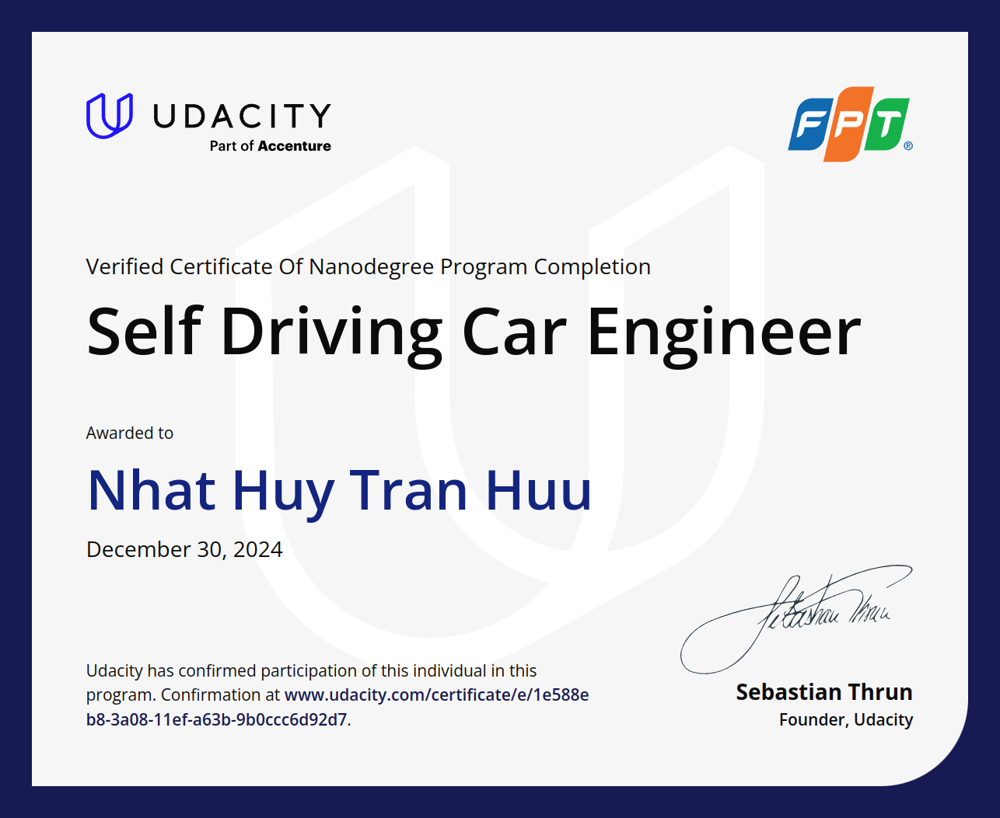
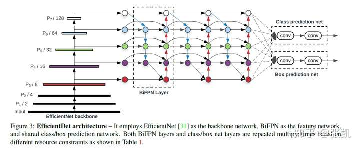
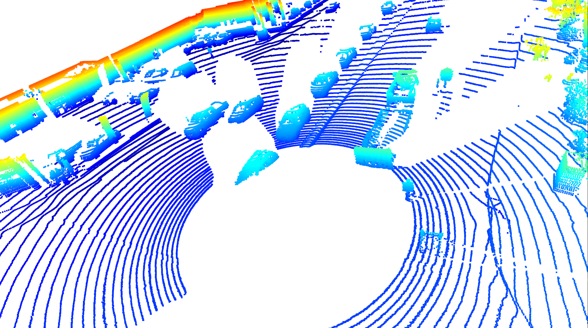
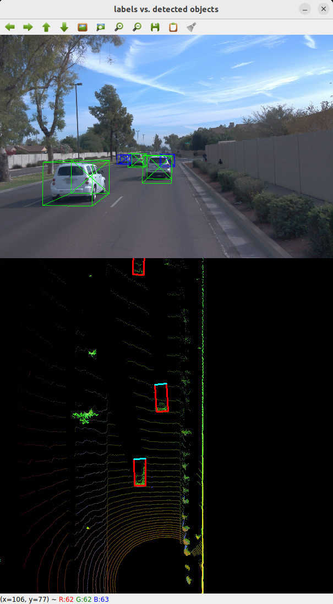
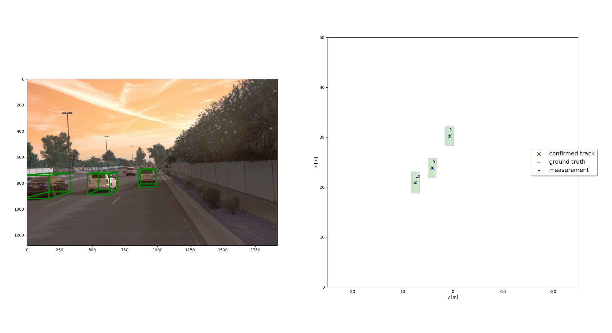
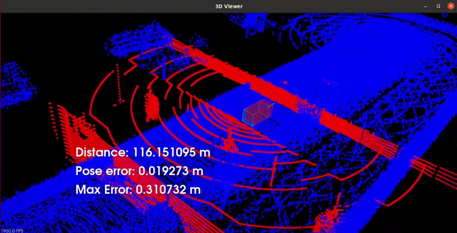
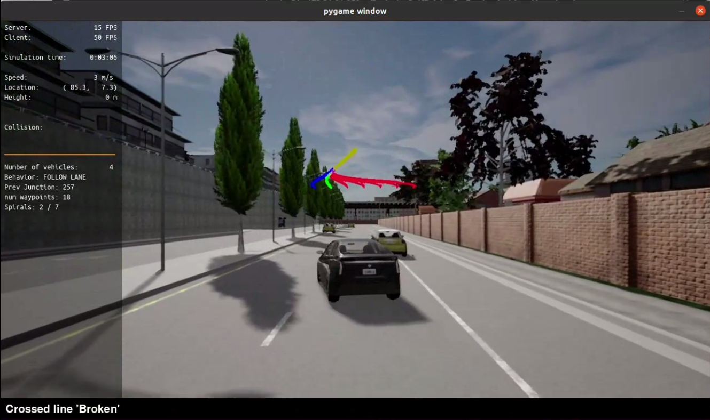

# Self-Driving Car Engineer - Udacity

This is a repo containing all my works in Udacity Nanodegree - Self Driving Car Engineer.

This program will cover the techniques that power self-driving cars across the full stack of a vehicle’s autonomous capabilities.
Here I demonstrate computer vision and deep learning approaches toward perception problems like lane finding, multi-object tracking, as well as a full end-to-end algorithm for driving with behavioral aspects. From this course I also learn how to track objects from radar and lidar data with sensor fusion. From there, I can implement the concepts behind localization, path planning and control, making sure vehicle knows where it is in the environment and how to navigate through it.

## Project 1. Object Detection in Urban Environments

In this project, I developed a deep learning model to detect and classify objects such as vehicles and pedestrians in urban settings. I utilized the [Waymo Open Dataset](https://waymo.com/open/) for training and validation, applying techniques like data augmentation and transfer learning to enhance model performance. Regarding the tech stack, I used [Tensorflow Object Detection API](https://tensorflow-object-detection-api-tutorial.readthedocs.io/en/latest/index.html) and [AWS Sagemaker](https://aws.amazon.com/sagemaker/) for an end-to-end training experience.

The [Efficient Det D1 640x480](https://github.com/openvinotoolkit/open_model_zoo/blob/master/models/public/efficientdet-d1-tf/README.md) model is used, which achieved a high accuracy in identifying objects, as you can see.

    

## Project 2. Sensor Fusion and Tracking

In this project, I developed a comprehensive system to detect and track vehicles over time by fusing data from LiDAR and camera sensors. Utilizing the Waymo Open Dataset, I implemented a pipeline that integrates object detection, sensor fusion using an Extended Kalman Filter (EKF), data association, and track management.

### a. Object detection

I employed a deep learning approach to detect vehicles in LiDAR data, transforming 3D point clouds into a bird's-eye view (BEV) representation. This perspective facilitated the application of convolutional neural networks (CNNs) for object detection. I utilized pre-trained models, such as [DarkNet](https://github.com/pjreddie/darknet) and [FPN-ResNet](https://pytorch.org/vision/main/models/generated/torchvision.models.detection.fasterrcnn_resnet50_fpn.html), fine-tuning them on the dataset to enhance detection accuracy. The detection pipeline included:

1. **Point cloud processing:** filtering and downsampling the raw LiDAR data to reduce noise and computational load.

2. **BEV transformation:** projecting 3D point cloud onto a 2D plane to create a BEV image suitable for CNN input.

3. **Object detection:** applying CNN to identify and localize vehicles within the BEV image.

### b. Sensor fusion with EKF

To achieve accurate state estimation, I implemented an EKF to fuse measurements from both LiDAR and camera sensors. The EKF accounted for the different noise characteristics and measurement models of each sensor, providing a more robust estimate of vehicle positions and velocities. Key steps include state vector definition, prediction, and update. There is also track management using the same principle for multi-object tracking.

## Project 3. Scan Matching Localization

In this project, I develop localization function for a simulated car in the **CARLA environment** using scan matching techniques. The car, equipped with a lidar sensor, traverses a distance of at least 170 meters while ensuring that the pose error remains below 1.2 meters throughout the run. Localization is achieved by aligning the lidar scans with a pre-generated point cloud map using point registration techniques such as **Iterative Closest Point (ICP)**.

## Project 4. Motion Planning and Decision Making

In this project, I implemented two of the main components of a traditional hierarchical planner: The Behavior Planner and the Motion Planner. Both will work in unison to be able to:

1. Avoid static objects (cars, bicycles and trucks) parked on the side of the road (but still invading the lane). The vehicle must avoid crashing with these vehicles by executing either a “nudge” or a “lane change” maneuver.

2. Handle any type of intersection (3-way, 4-way intersections and roundabouts) by STOPPING in all of them (by default)

3. Track the centerline on the traveling lane.

Features implemented:

- Behavioral planning logic using Finite State Machines - FSM.

- Static objects collision checking.

- Path and trajectory generation using cubic spirals.

- Best trajectory selection though a cost function evaluation. This cost function will mainly perform a collision check and a proximity check to bring cost higher as we get closer or collide with objects but maintaining a bias to stay closer to the lane center line.

## Project 5. Control and Trajectory Tracking

Similar to Project 4, but this time with a **Proportional-Integral-Derivative (PID)** controller to guide an autonomous vehicle along a predefined trajectory in a simulated environment. This project offers hands-on experience with fundamental control systems, preparing students for real-world challenges in autonomous vehicle development by integrating theoretical principles with practical simulation-based testing.

## Final words

Through these projects, I believe I have acquired and consolidated a comprehensive understanding of the essential components of autonomous vehicle systems, including perception, sensor fusion, localization, planning, and control. I look forward to contribute to the advancement of AD/ADAS technology in the upcoming years.