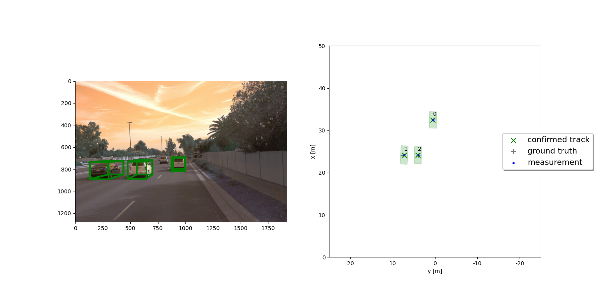
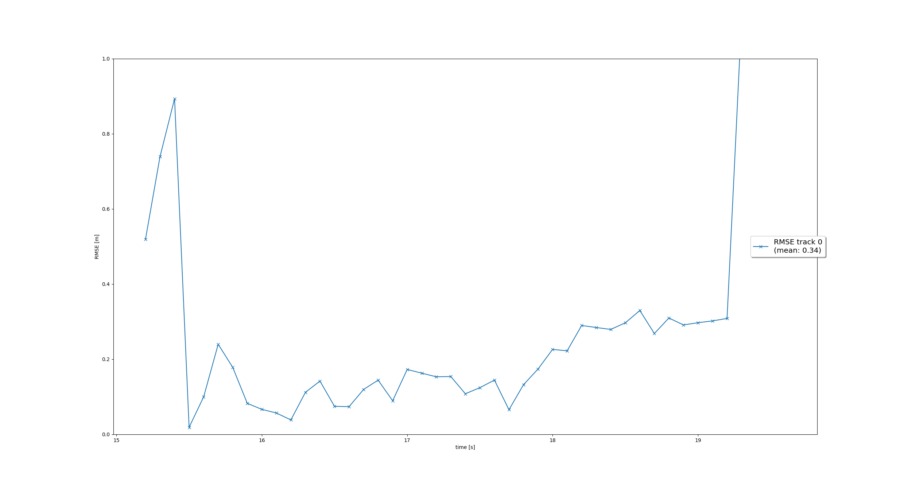
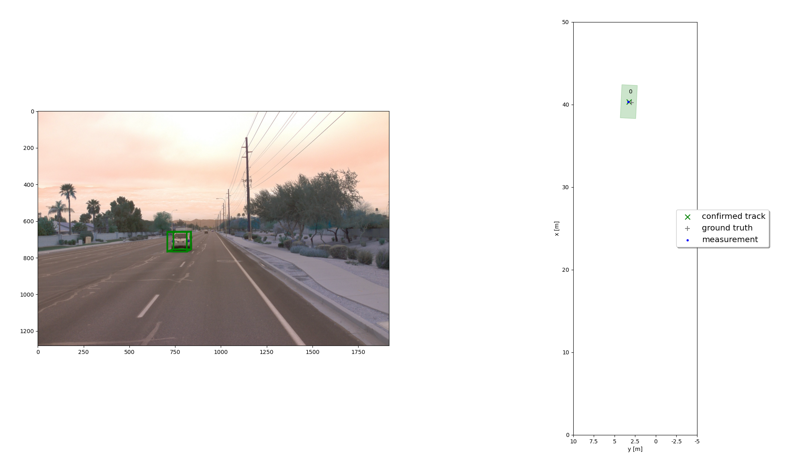
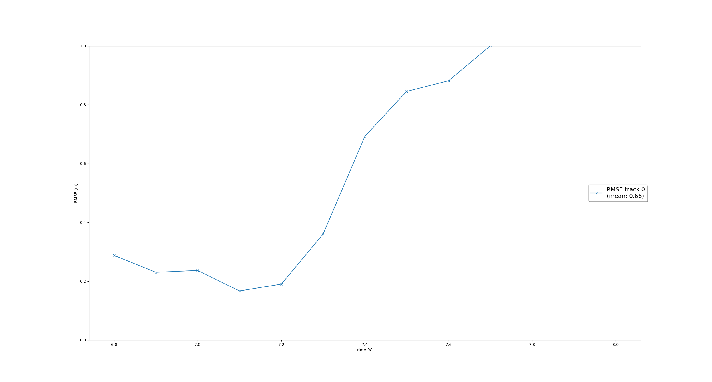
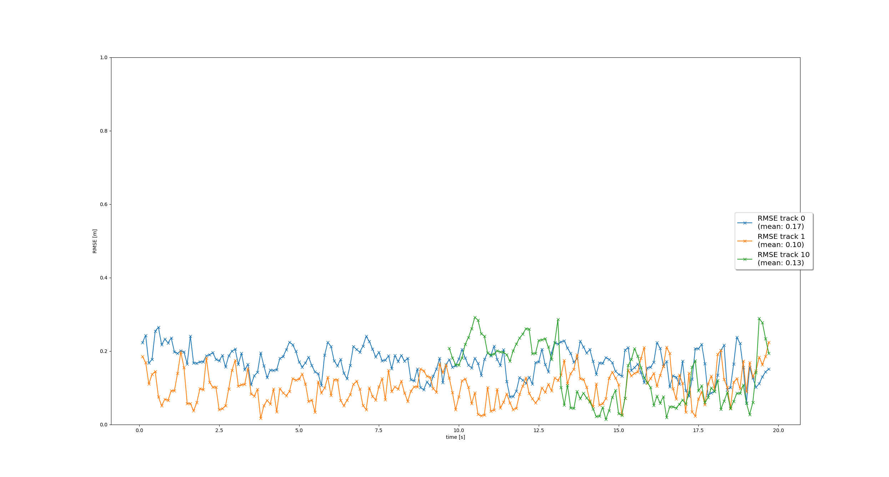

# FINAL PROJECT REPORT: TRACK-3D OBJECTS OVER TIME

## I. Project introduction

The final project consists of four main steps:

1. Implement an extended Kalman filter.
2. Implement track management including track state and track score, track initialization and deletion.
3. Implement single nearest neighbour data association and gating.
4. Apply sensor fusion by implementing the nonlinear camera measurement model and a sensor visibility check.

## II. Writeups

### 1. Write a short recap of the four tracking steps and what you implemented there (filter, track management, association, camera fusion). Which results did you achieve? Which part of the project was most difficult for you to complete, and why?

#### a. Step 1 - Filter

In the `student/filter.py` script I implement a Kalman filter to track 3D objects over time. The key steps include:

1. Prediction: compute the predicted state `x` and error covariance `P` for the next time step using the system matrix `F` and process noise covariance `Q`.
2. Update: adjust the state and covariance based on measurements `meas` using the residual `gamma` and residual covariance `S`.
3. Residuals: `gamma` calculates the difference between the expected and actual measurements, while `S` computes the associated covariance.

Other matrices are also taken into account like `F`, `Q`, `H` and `R`.

For the results, we have below RMSE and a screenshot. The error starts relatively high, indicating a transient phase where the Kalman filter is adjusting to the initial measurements. Over time, the RMSE stabilizes, with mean of `0.34 m` indicating a good tracking under normal conditions.

#### b. Step 2 - Track management

In `student/trackmanagement.py`, the `Track` and `Management` classes are designed to manage and update 3D object tracking over time. `Track` class encapsulates the state of a tracked object, including state vector `x`, covar matrix `P`, with corresponding attributes and tracking states (`initialized`, `tentative`, `confirmed`), along with a track score. I also successfully implemented track initialization, deletion, and updates.

Below plot shows RMSE mean value of 0.66 meters. After time 7.4 seconds, the error increases significantly, this is because initially a new track is itinialized automatically where unassigned measurements occur, then true track is confirmed quickly, and the track is deleted after it has vanished from the visible range, which is why the error skyrocketed. I also confirm that the track has been deleted as the console output says `deleting track no. 0`. 

#### c. Step 3 - Association

In `student/association.py`, the `Association` class handles data association between predicted tracks and measurements, leveraging the Mahalanobis distance for gating and matching. Basically everything has been done as instructed.

In RMSE plot below, you can see 3 tracks, `0`, `1` and `10` with mean RMSEs of 0.17m, 0.10m, and 0.13m, respectively. The results show low tracking error across multiple tracks, with their RMSEs remaining stable throughout the timeline, demonstrating good tracking and consistent performance even under varying conditions. These results are the same with step 4.

#### d. Step 4 - Measurements

In `student/measurements.py`, `Sensor` class models the characteristics and functionalities of the sensors (lidar and camera). It includes srnsor properties such as FoV, coord transformation, FoV check, nonlinear measurement, etc. 

You can see the tracking video below. In case GitHub does not support preview of video in markdown files, you can access them at `/project2.1-3d-object-detection/results/my_tracking_results.avi` from the master repo root.

### 2. Do you see any benefits in camera-lidar fusion compared to lidar-only tracking (in theory and in your concrete results)? 

I believe that in theory, camera-lidar fusion has much better advantages over lidar only tracking. Lidar alone provides precise 3D spatial data, including position, size, and shape, but lacks detailed appearance information. Camera alone offers high-resolution texture and color information, aiding in distinguishing visually similar objects (e.g., cars of different colors). The fusion of those 2 leverages the strengths of both sensors to improve object detection and tracking overall, in terms of robustness, object identification, etc.

In my results, the fused system achieved a mean RMSE of 0.13m to 0.17m across multiple tracks (e.g., track 0: 0.17m, track 1: 0.10m, track 10: 0.13m). This is likely better than a lidar-only approach, which may struggle with higher RMSE due to lidar's limitations in certain environments. Also, in the visualized results, camera data helped associate tracks consistently even when objects were partially occluded or partially visible in the lidar frame.

In additional, fused system nails it well when it comes to multi-tracking. The fused system effectively tracked multiple objects simultaneously, as shown in the bounding boxes and alignment in 3D space. Lidar-only tracking might have faced challenges with tightly spaced objects due to lower resolution or sparsity in the point cloud.

### 3. Which challenges will a sensor fusion system face in real-life scenarios? Did you see any of these challenges in the project?

In real life, the most prevalent challenge wil lbe calibration issues. I read a random post on LinkedIn a while ago saying that CV/AD/ADAS engineers should also care for camera calibration too, not just jocking softwares only, and I agree with him. Accurate calibration between sensors is crucial for fusing data in a common reference frame. Any misalignment in lidar-camera extrinsic or intrinsic parameters can cause inconsistencies in fused measurements.

Also, sensors may capture data at different frequencies or times, leading to time mismatches. These misalignments can distort fused data, particularly for dynamic objects in motion. Anyway, this is another problem with calibration right?

In theory there are also a lot of problems too, such as random sensor failures, occlusions and partial observations, environmental constraints, etc.

In my project, slight RMSE variations and mismatches suggest potential limitations in resolving closely spaced or dynamically moving objects. Also, occulsions are there too, in situations where camera or lidar missed part of an object, which may have impacted track stability or precision. Environmental noise is also there too, but that's obvious.

### 4. Can you think of ways to improve your tracking results in the future?

To enhance tracking results, we can do something like:

- Improve sensor fusion algorithm with Bayesian filters, more SOTA deep learning methods, or multi-sensor fusion instead of just these 2.
- Data association can also be improved via GNN or JPDA.
- Better sensors, or better hardware/GPUs, simply as that.