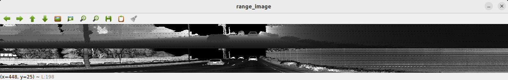
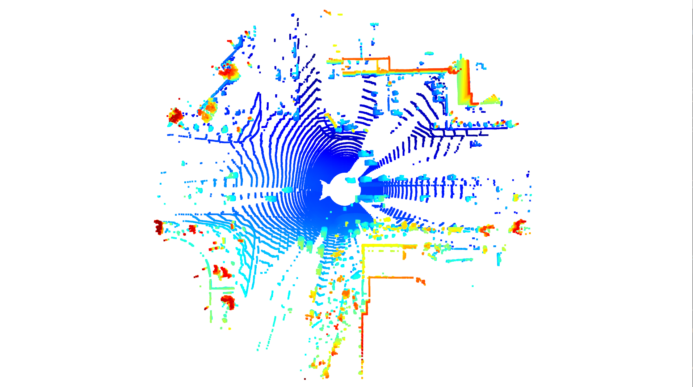
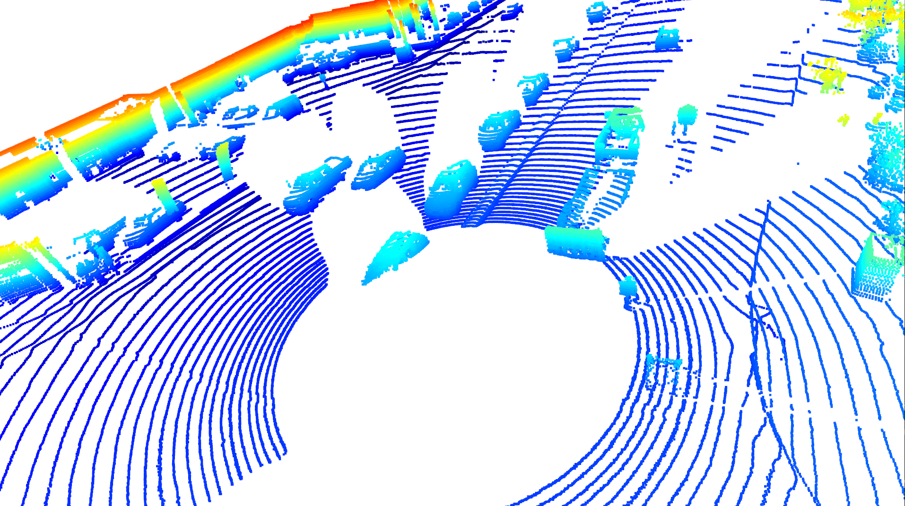
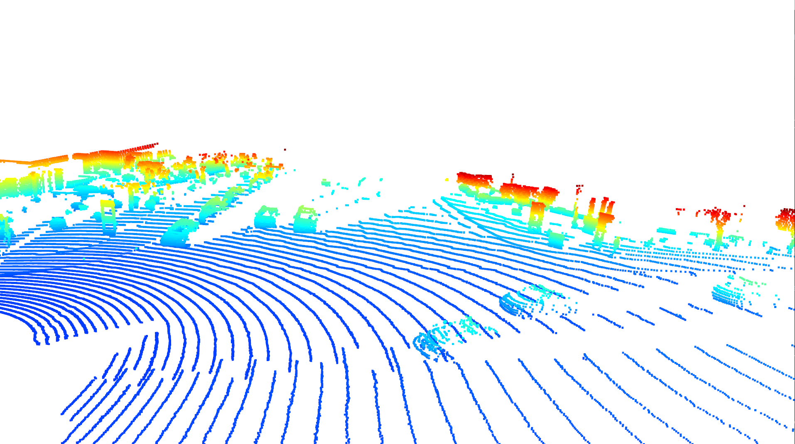
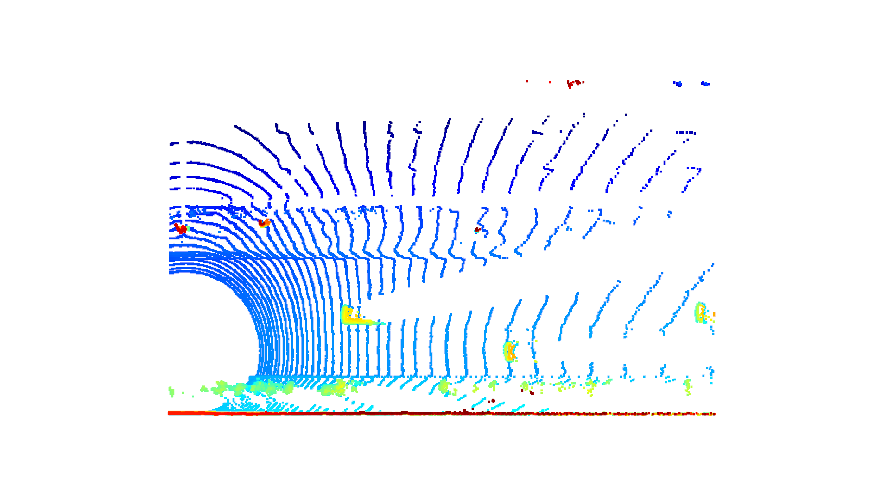
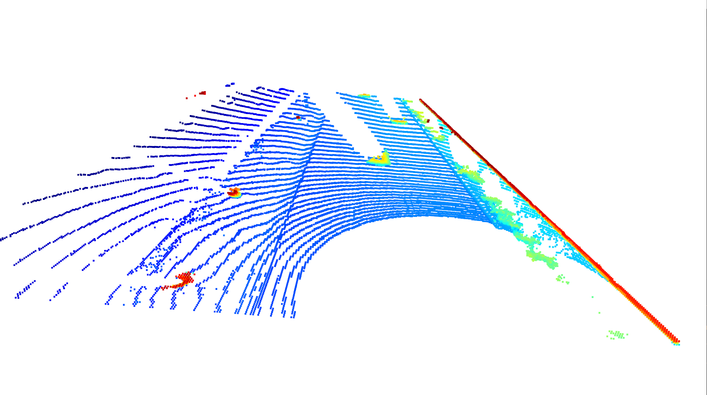
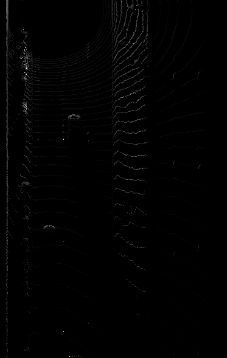
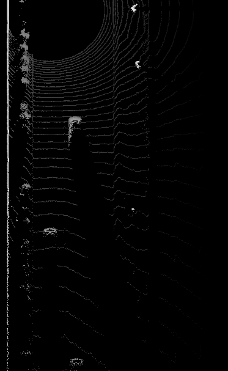
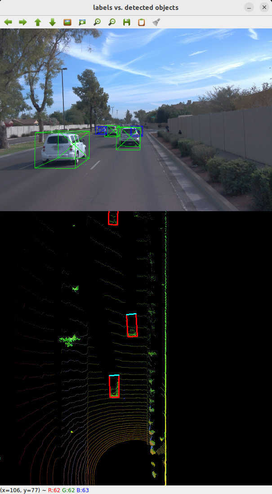
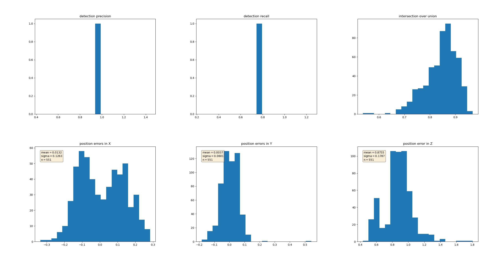

# PROJECT 2.1: 3D OBJECT DETECTION WITH LIDAR DATA

The primary goal of this mid-term project was to implement a robust pipeline for detecting 3D objects using lidar data from the Waymo Open Dataset. The project emphasized key concepts in lidar data processing, object detection, and object tracking, laying the foundation for developing perception systems in autonomous vehicles. As an aspiring student in this AD/ADAS field, I am very interested in this project.

There are 3 training segments from [Waymo Open Dataset](https://waymo.com/open/) that will be used in this project, including:

- Sequence 1: `training_segment-1005081002024129653_5313_150_5333_150_with_camera_labels.tfrecord`
- Sequence 2: `training_segment-10072231702153043603_5725_000_5745_000_with_camera_labels.tfrecord`
- Sequence 3: `training_segment-10963653239323173269_1924_000_1944_000_with_camera_labels.tfrecord`

## I. Compute Lidar Point-Cloud from Range Image

### 1. Visualize range image channels (ID_S1_EX1)

In this task, a lidar range image from the  is given, which is extracted and visualized in a grayscale format, as seen below.

Above is the grayscale visualization of frame 0 from sequence 1, created using the `show_range_image` function in `student/objdet_pcl.py`. This visualization represents the environment in a 2D format using information derived from the lidar's 3D point cloud data, including 2 parts:

- Top half represents the **range channel**, which encodes the distance of objects from the lidar sensor. Bright regions indicate objects that are closer to the sensor, while darker regions correspond to farther objects or areas with no lidar returns (e.g., sky). The gradient in brightness from the center to the edges corresponds to increasing distance.
- Bottom half represents the **intensity channel**, which encodes the reflectivity of objects in the environment. Bright spots indicate objects with high reflectivity (e.g., road signs, vehicles, or metallic surfaces), while darker regions correspond to low-reflectivity objects (e.g., asphalt, vegetation) or areas where no lidar returns were registered.

### 2. Visualize lidar point-cloud (PCL) (ID_S1_EX2)

The goal of this task is to use the Open3D library to display the lidar point-cloud in a 3d viewer in order to develop a feel for the nature of lidar point-clouds. The script could also be found in `show_pcl` of `student/objdet_pcl.py`. Below are top-down view of the PCL, as well as 10 examples of vehicles with varying degrees of visibility in the PCL.

In the last 2 images, you can see more than 10 vehicles, mostly cars and some trucks. 

We can observe a varying visibility between different cars, particularly depending on their relative locations to the ego vehicle. While most vehicles can be recognized, those far away from the ego, or behind other vehicles in the line-of-sight of the ego, tend to have lower visibility, which is pretty much obvious considering the way LiDAR works.

Regarding features, while most vehicles have their **chassises** detected clearly on LiDAR, there are other features that aren't quite explicit, such as wheels, and interestingly, windshields. While wheels are quite explainable, I had to search for a while on the problem with windshields, and it seems that most standard windshield glass is designed to transmit the specific wavelength of light used by LiDAR, essentially making it transparent to the sensor, meaning the laser pulses pass through the glass instead of reflecting back to the LiDAR unit, preventing it from detecting the windshield as a solid object. This explains why a lot of cars in the LiDAR PCL above do not have windshield.

## II. Create Birds-Eye View from Lidar PCL

### 1. Convert sensor coordinates to BEV-map coordinates (ID_S2_EX1)

With the LiDAR data, lidar points are converted from the sensor coordinate system into Bird's-Eye View (BEV) map coordinates. The BEV map is used for 3D object detection, where the environment is visualized as a top-down projection. This task could be found in `bev_from_pcl` of `student/objdet_pcl.py`. Below is the BEV-map coordinates of the converted sensor coordinates, from frame 0 of sequence 1.

### 2. Compute intensity layer of bev-map (ID_S2_EX2)

Next, in the same function, I process lidar data to generate an intensity map for the BEV representation. It begins by initializing a zero-filled numpy array `intensity_map` to store the intensity values, ensuring the map has the same dimensions as the BEV grid. The lidar point cloud is then sorted based on x, y, and negative z-coordinates using `np.lexsort()`, ensuring points are ordered by their spatial location and that the highest point (top-most z-value) is prioritized. Using `numpy.unique()`, only the top-most points for each x, y grid cell are retained, and the count of points per cell is stored for potential use in subsequent tasks. The intensity values of these unique points are scaled between 0 and 1, normalized using the difference between the maximum and minimum intensity values, which mitigates the effect of outliers. These normalized intensity values are then assigned to their corresponding positions in the intensity map. Finally, the intensity map is temporarily visualized using OpenCV, with pixel values mapped to an 8-bit scale (0-255), allowing for visual validation of the separation between objects (e.g., vehicles) and the background.

### 3. Compute height layer of bev-map (ID_S2_EX3)

Finally, in the very same function, I generate the height layer of the BEV map by initializing a zero-filled numpy array with the same dimensions as the BEV grid. For each unique lidar point from the previous task, the height value is normalized using the configured height range and assigned to the corresponding cell in the height map. The resulting map is then optionally visualized using OpenCV, scaled to an 8-bit representation, to validate the separation of objects like vehicles from the background.

## III. Model-based Object Detection in BEV Image

Step 3 is the conduct object detection on those BEV images using FPN Resnet and Darknet (all prebuilt). As you can see in the file `student/objdet_detect.py`, I defined model configuration parameters for ResNet, but also modified a little bit on DarkNet. Then, model reference of ResNet will try to detect cars from BEV map, which are then decoded and processed using non-maximum suppression (NMS) to refine bounding boxes. The resulting detections are filtered to ensure they lie within predefined spatial limits and are converted into 3D object representations with attributes such as position, dimensions, and orientation. As you can see below, a frame whose cars are being detected in bounding boxes.

## IV. Performance Evaluation for Object Detection

Finally, in this section, all works can be viewed in `student/objdet_eval.py`, including:

- Compute intersection-over-union (IOU) between labels and detections (ID_S4_EX1).
- Compute false-negatives and false-positives (ID_S4_EX2).
- Compute precision and recall (ID_S4_EX3).

For evaluation, using sequence 1, I conduct object detection from frame 0 to frame 199, which are 200 frames in total. Below is the result, with `precision = 0.93867` and `recall = 0.74459` which are quite decent.

## V. Conclusion

In this project, I have successfully developed a pipeline for 3D object detection and using solely lidar data from the Waymo Open Dataset. By preprocessing point clouds into BEV maps, leveraging deep learning models like Darknet and FPN-ResNet, and integrating robust tracking with Kalman filters, I can detect objects in a 3D environment. I found the project engaging and interesting.