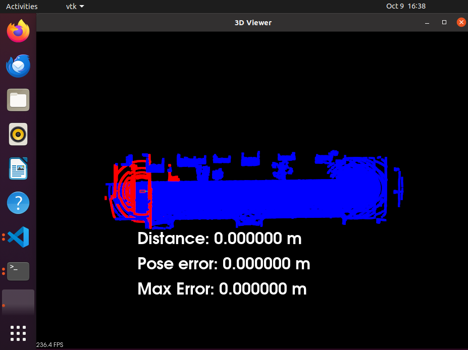

# PROJECT - SCAN MATCHING LOCALIZATION

## I. Introduction

The **Scan Matching Localization** project is the 3trd project of [Udacity Nanodegree: Self Driving Car Engineer](https://www.udacity.com/course/self-driving-car-engineer-nanodegree--nd0013). It focuses on developing localization function for a simulated car in the **CARLA environment** using scan matching techniques. The car, equipped with a lidar sensor, traverses a distance of at least 170 meters while ensuring that the pose error remains below 1.2 meters throughout the run. Localization is achieved by aligning the lidar scans with a pre-generated point cloud map (`map.pcd`) using point registration techniques such as **Iterative Closest Point (ICP)**.

## II. Tasks

Refer to starter files in [original project directory](https://github.com/udacity/nd0013_cd2693_Exercise_Starter_Code/tree/main/Lesson_7_Project_Scan_Matching_Localization).

**1. Filter scan using voxel filter**

The first step is fairly short - make use of `cloudFiltered` and `scanCloud` to filter the point cloud using a voxel grid.

**2. Find pose transform by using ICP or NDT matching**

The second step is the main portion of the exercise. You can choose to use either ICP or NDT matching in order to find the pose transformation. It is suggested to keep the code for this fairly short within the `main()` function, and instead call out to a separate function you create either elsewhere within `c3-main.cpp` or in a separate `.cpp` file. Note also that you can make use of the `getPose()` function in `helper.cpp` if you output a 4D transform matrix from your ICP or NDT function in order to get the `Pose` object.

**3. Transform the scan so it aligns with ego's actual pose and render that scan**

In the final major step, you should be able to transform the filtered scan using your calculated transform into a new point cloud using `pcl`.

Note that you will also want to update what is fed into `renderPointCloud` to change `scanCloud` into your newly transformed point cloud, or else your transform will not be appropriately rendered.

## III. Results

