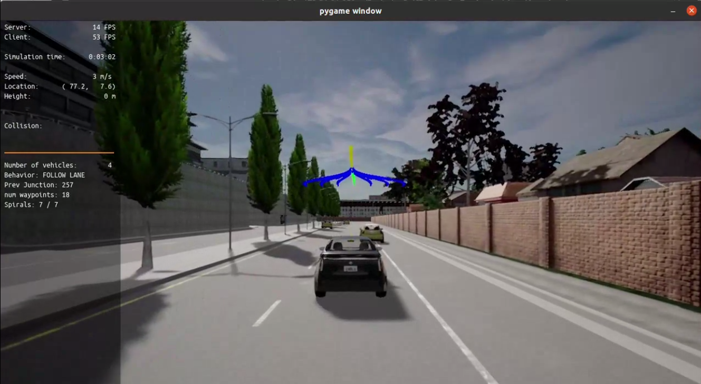
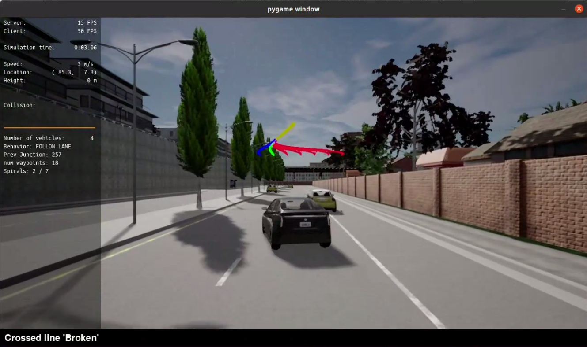

# PROJECT - MOTION PLANNING AND DECISION MAKING FOR AUTONOMOUS VEHICLES

## I. Introduction

The **Motion Planning and Decision Making for Autonomous Vehicles** project is the 4th project of [Udacity Nanodegree: Self Driving Car Engineer](https://www.udacity.com/course/self-driving-car-engineer-nanodegree--nd0013). It focuses on developing core algorithms that empower autonomous vehicles to navigate complex real-world scenarios safely and efficiently. As part of above mentioned course, this project combines theoretical knowledge and practical implementation of planning techniques.

Students implement key components of a hierarchical planner to enable autonomous vehicles to navigate safely and intelligently through various road scenarios. The project emphasizes developing the **Behavior Planner** and **Motion Planner**, two integral parts of the planning pipeline, to achieve dynamic and context-aware driving behaviors.

## II. Tasks

In this project, you will implement two of the main components of a traditional hierarchical planner: The Behavior Planner and the Motion Planner. Both will work in unison to be able to:

1. Avoid static objects (cars, bicycles and trucks) parked on the side of the road (but still invading the lane). The vehicle must avoid crashing with these vehicles by executing either a “nudge” or a “lane change” maneuver.

2. Handle any type of intersection (3-way, 4-way intersections and roundabouts) by STOPPING in all of them (by default)

3. Track the centerline on the traveling lane.

To accomplish this, you will implement:

* Behavioral planning logic using Finite State Machines - FSM
* Static objects collision checking.
* Path and trajectory generation using cubic spirals
* Best trajectory selection though a cost function evaluation. This cost function will mainly perform a collision check and a proximity check to bring cost higher as we get closer or collide with objects but maintaining a bias to stay closer to the lane center line.

## III. Results

### 1. Discussions

The full screen recording of the demo run could be seen in `assets/demo_run.mp4` of this repo.

During this project, I set the general params for motion planning as below (you can refer more in `starter_files/planning_params.h`):

```
#define P_NUM_PATHS 7 //1              // Num of paths (goals)
#define P_LOOKAHEAD_MIN 8.0            // m
#define P_LOOKAHEAD_MAX 20.0           // m
#define P_LOOKAHEAD_TIME 1.5           // s
#define P_GOAL_OFFSET 1.0              // m
#define P_ERR_TOLERANCE 0.1            // m
#define P_TIME_GAP 1.0                 // s
#define P_MAX_ACCEL 1.5                // m/s^2
#define P_SLOW_SPEED 1.0               // m/s
#define P_SPEED_LIMIT 3.0              // m/s
#define P_STOP_LINE_BUFFER 0.5         // m
#define P_STOP_THRESHOLD_SPEED 0.02    // m/s
#define P_REQ_STOPPED_TIME 1.0         // secs
#define P_LEAD_VEHICLE_LOOKAHEAD 20.0  // m
#define P_REACTION_TIME 0.25           // secs
#define P_NUM_POINTS_IN_SPIRAL 25      // Num of points in the spiral
#define P_STOP_THRESHOLD_DISTANCE \
  P_LOOKAHEAD_MIN / P_NUM_POINTS_IN_SPIRAL * 2  // m
```

With this, each of `dt = 0.5` seconds there are 7 polynomial paths to be considered, as seen below:



As you can see throughout the demo run, the vehicle demonstrates the ability to detect and avoid static obstacles, such as parked cars, within its lane. It successfully performs **nudge maneuvers** and **lane changes** when appropriate, ensuring a smooth and collision-free trajectory.




The vehicle also consistently tracks the centerline of its traveling lane, maintaining a stable and predictable path. This reflects the effectiveness of the cubic spiral trajectory generation and the cost function's design to prioritize proximity to the centerline. In additiona, it also dynamically evaluates and selects optimal trajectories, balancing collision avoidance with adherence to the lane. From the results, it seems the cost function is well-calibrated to penalize proximity to obstacles while encouraging smooth navigation.

### 2. Potential improvements

- While the system performs lane changes effectively, there are moments where the timing of the maneuver could be optimized to minimize abrupt movements and improve overall passenger comfort (jerk minimizing).
- In this video, since it's just a student project, there are no scenarios with highly complex intersections or moving obstacles, thus this approach will highly not viable in real-life scenarios. More works will need to be done to ensure a better planning method.