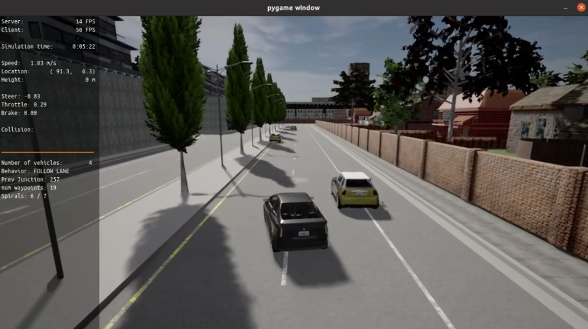
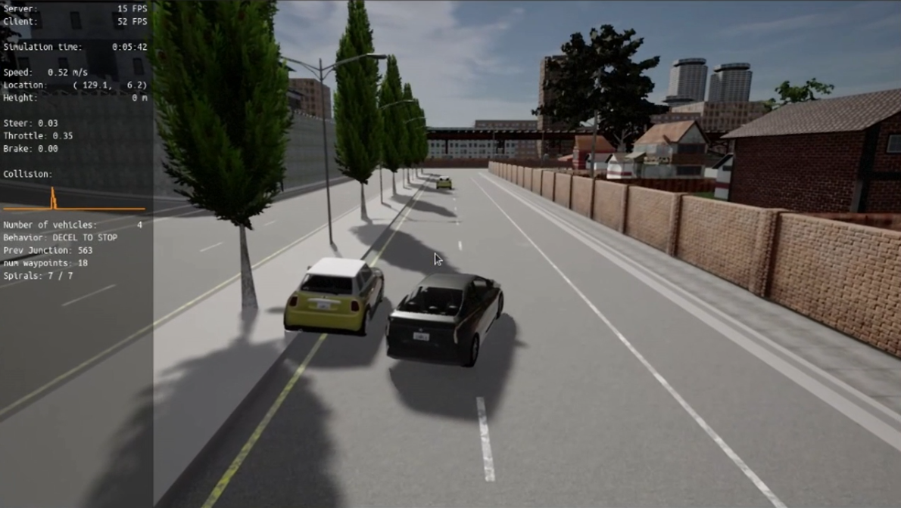
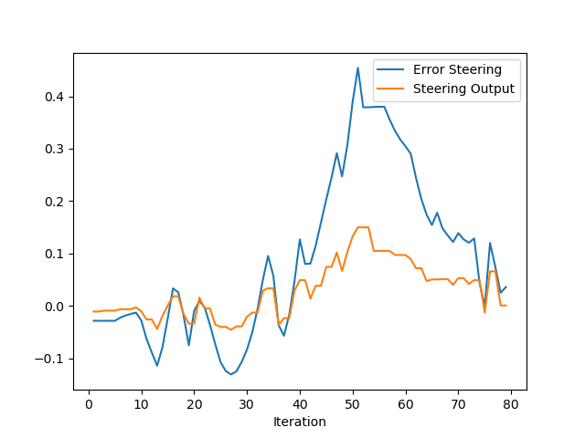
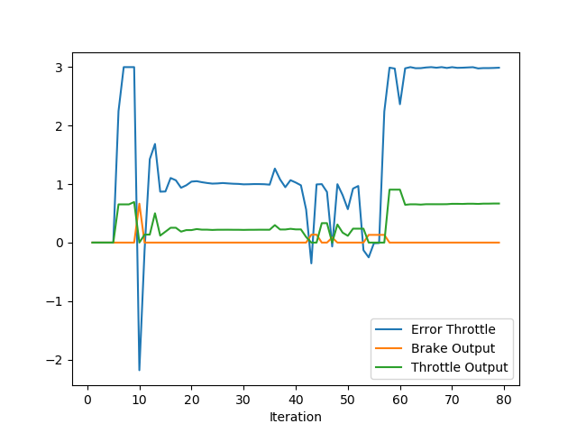

# PROJECT - CONTROL & TRAJECTORY TRACKING FOR AUTONOMOUS VEHICLES

## I. Introduction

The **Control & Trajectory Tracking for Autonomous Vehicles** project is the 5th and final mandatory project of [Udacity Nanodegree: Self Driving Car Engineer](https://www.udacity.com/course/self-driving-car-engineer-nanodegree--nd0013). It focuses on implementing and tuning control algorithms to enable precise trajectory tracking. In this project, students design a **Proportional-Integral-Derivative (PID)** controller to guide an autonomous vehicle along a predefined trajectory in a simulated environment.

Using the CARLA simulator, an industry-standard tool, students test their PID controller's ability to maintain accurate and stable vehicle control while tracking a series of waypoints. The project emphasizes understanding the interplay between the PID components (Proportional, Integral, and Derivative) and tuning their parameters to optimize the vehicle's performance.

This project offers hands-on experience with fundamental control systems, preparing students for real-world challenges in autonomous vehicle development by integrating theoretical principles with practical simulation-based testing.

## II. Tasks

### 1. Design PID controller

- Develop a **Proportional-Integral-Derivative (PID)** controller in C++ to compute the control inputs needed for precise trajectory tracking.
- Understand and implement the mathematical framework behind the PID algorithm, focusing on its proportional, integral, and derivative components.

### 2. Integrate with CARLA simulator

- Set up a simulation environment using the CARLA simulator.
- Connect the PID controller to the CARLA simulator to enable the autonomous vehicle to receive control commands and provide feedback.

### 3. Parameter tuning

- Optimize the PID parameters for accurate and stable trajectory tracking.
- Balance the trade-offs between overshooting, settling time, and steady-state error.

### 4. Testing and performance visualization

- Generate plots to analyze the controller's performance, including metrics like tracking error, control input behavior, and stability over time.
- Record a video from the CARLA simulator to visually demonstrate the controller's success in tracking the trajectory.

## III. Results

### 1. PID controller and parameter tuning

The full screen recording of the demo run could be seen in `assets/demo_run.mp4` of this repo. You can see that the car struggles to pass first 2 obstacles, but eventually succumbed to the last one. This is the furthest param tuning I could get.

During this project, I set the general params for motion planning as below (you can refer more in `starter_files/planning_params.h`):

```
#define P_NUM_PATHS 7 //1              // Num of paths (goals)
#define P_LOOKAHEAD_MIN 8.0            // m
#define P_LOOKAHEAD_MAX 20.0           // m
#define P_LOOKAHEAD_TIME 1.5           // s
#define P_GOAL_OFFSET 1.0              // m
#define P_ERR_TOLERANCE 0.1            // m
#define P_TIME_GAP 1.0                 // s
#define P_MAX_ACCEL 1.5                // m/s^2
#define P_SLOW_SPEED 1.0               // m/s
#define P_SPEED_LIMIT 3.0              // m/s
#define P_STOP_LINE_BUFFER 0.5         // m
#define P_STOP_THRESHOLD_SPEED 0.02    // m/s
#define P_REQ_STOPPED_TIME 1.0         // secs
#define P_LEAD_VEHICLE_LOOKAHEAD 20.0  // m
#define P_REACTION_TIME 0.25           // secs
#define P_NUM_POINTS_IN_SPIRAL 25      // Num of points in the spiral
#define P_STOP_THRESHOLD_DISTANCE \
  P_LOOKAHEAD_MIN / P_NUM_POINTS_IN_SPIRAL * 2  // m
```

Also, after days after nights trying to tune the PID params, as well as extensively searching for clues, I have finally came up with the PID parameters as below:

```C
// PID steering params
const double P_STEER_Kp = 0.3;
const double P_STEER_Ki = 0.0025;
const double P_STEER_Kd = 0.17;
const double P_STEER_MAX = 0.6;
const double P_STEER_MIN = -0.6;

// PID throttle params
const double P_THROTTLE_Kp = 0.21;
const double P_THROTTLE_Ki = 0.0006;
const double P_THROTTLE_Kd = 0.08;
const double P_THROTTLE_MAX = 1.0;
const double P_THROTTLE_MIN = -1.0;
```

As you can see from the demo, the vehicle demonstrates the ability to detect and avoid static obstacles, such as parked cars, within its lane. It successfully performs **nudge maneuvers** and **lane changes** when appropriate, ensuring a (smooth) and (almost) collision-free trajectory.





### 2. Evaluate and analyze the PID controller

#### a. Steering

As mentioned, my params are:

```C
// PID steering params
const double P_STEER_Kp = 0.3;
const double P_STEER_Ki = 0.0025;
const double P_STEER_Kd = 0.17;
const double P_STEER_MAX = 0.6;
const double P_STEER_MIN = -0.6;
```

Below is the evaluation plot of PID steering.



In the graph above, blue line represents CTE (cross-track error) over the iterations. This CTE ndicates how far the vehicle is from the desired trajectory. Orange line represents steering output of this PID system.

You can see the PID controller's performance in correcting the steering to reduce the CTE. At the beginning the error is minimal. As iterations progress, the error initially fluctuates but gradually decreases, reflecting the controller's effort to stabilize the vehicle along the desired path.

#### b. Throttle

Similarly, below are PID throttle params and evaluation plot.



You can see in the plot the throttle error in blue, throttle output in green, and brake output in orange.

The PID controller's performance is directly reflected in the plot, with:

- `P_THROTTLE_Kp = 0.21` : proportional gain which is responsible for generating a control output proportional to current error. In the plot, sharp and immediate changes in throttle output correspond to the proportional response to large errors (e.g., peaks in the error curve). This helps the system react quickly to deviations but may cause oscillations if the value is a lil bit too high.

- `P_THROTTLE_Ki = 0.0006` : integral gain, which accumulates the error over time, addressing any persistent offsets (steady-state error). Its effect is subtle but noticeable in maintaining long-term stability. The low integral gain in this configuration minimizes overshooting but ensures the controller corrects any lingering error over time.

- `P_THROTTLE_Kd = 0.08` : derivative gain, which dampens the system's response to sudden changes in error by considering the error's rate of change. In the plot, the smooth transitions and reduced oscillations in the throttle output highlight the derivative action's stabilizing effect, especially during periods of rapid error change.

Althought the throttle seems to have much higher error compared to steering, I still see this error across a lot of reports and topics in the Knowledge session so I assume it to be quite the norm.

## IV. Discussion

### 1. How would you design a way to automatically tune the PID parameters?

After some literature reviews, I would like to introduce some methods:

#### a. Gradient-free optimization

Techniques like *Ziegler-Nichols*, *Twiddle (Coordinate Descent)*, or *CMA-ES (Covariance Matrix Adaptation Evolution Strategy)* can be used to systematically search for optimal parameters. These methods do not require system derivatives, making them ideal for noisy environments or systems where gradients are hard to compute. Also, they work well for model-free controllers as they only require performance feedback.

The workflow is kinda like this:

1. Start with an initial guess for the parameters (Kp, Ki, Kd).
2. Evaluate the PID controller’s performance using a cost function, e.g., minimizing the integral of absolute error (IAE), overshoot, or settling time.
3. Iteratively adjust the parameters to reduce the cost function value.

#### b. Machine learning-based

Use reinforcement learning (RL) or supervised learning to dynamically adjust PID parameters based on the system's response. RL adapts well to dynamic systems, enabling real-time adjustments to PID gains. Also, using such a buzz word like "mAcHiNe LeArNiNg" would be a plus in your project lol.

#### c. Adaptive PID coltrol

Use an adaptive PID controller that adjusts its parameters in real time based on system performance. First, use a meta-controller to monitor the system's response and dynamically modify the PID gains. Then, implement techniques like gain scheduling, where parameters are pre-tuned for different operating conditions and switched dynamically.

If I have more time, I will try to implement some automatic tuning methods like these, instead of relying on such a time-consuming manual process like this.

### 2. PID controller is a model free controller, i.e. it does not use a model of the car. Could you explain the pros and cons of this type of controller? Find at least 2 pros and cons for model free versus model based.

Firstly, let's discuss about pros and cons:

#### a. Pros

- Simplicity. Model-free controllers like PID are straightforward to design and implement. They do not require a mathematical model of the system, making them suitable for systems with unknown or complex dynamics.
- Robustness. Since they rely on feedback from the actual system, they are inherently robust to uncertainties and disturbances.

#### b. Cons

- Model-free controllers react to errors but cannot predict future system behavior. This limits their ability to anticipate changes or handle delays effectively.
- Without a model, tuning becomes challenging for systems with highly nonlinear or time-varying dynamics. Performance may degrade in such scenarios. This is the problem and also a great suffering for all the students here in this course.

Next, let's talk about MPC. Model-based controllers use a system model to predict future behavior and optimize control actions accordingly, reducing overshoot and improving stability, making it a great advantage over model-free. Also, they excel in handling multivariable and constrained systems by optimizing control inputs over a prediction horizon.

However, as suggested above, due to its complexity, developing an accurate model can be time-consuming and requires significant expertise. Implementation complexity is higher than model-free approaches. In addition, performance heavily depends on the accuracy of the system model. Any mismatch between the model and the real system can lead to instability or suboptimal performance.

So basically, in the end, it's a trade-off between simple but low-performance, and complex but high-performance.

### 3. What would you do to improve the PID controller?

As discussed above in Session 1, several things I wanna do if I had more time on this project:

- Feedforward control
- Nonlinear or adaptive gains
- Cascade control
- Noise filtering

And the list continues.